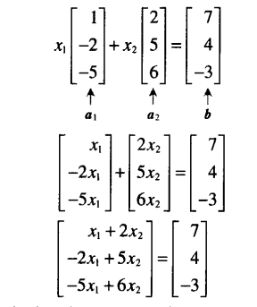
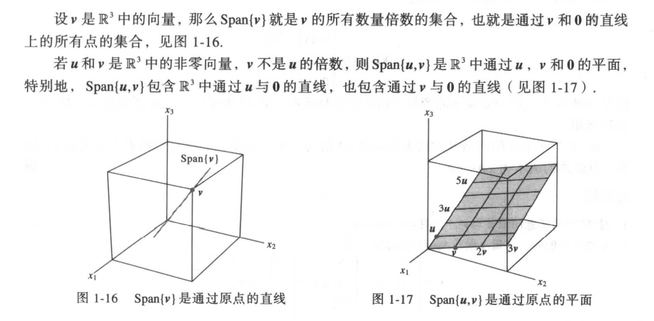
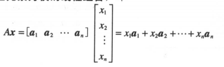
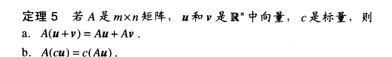
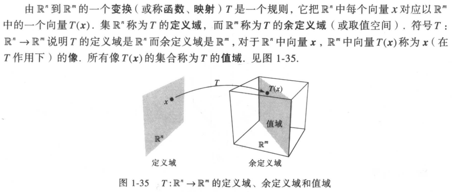
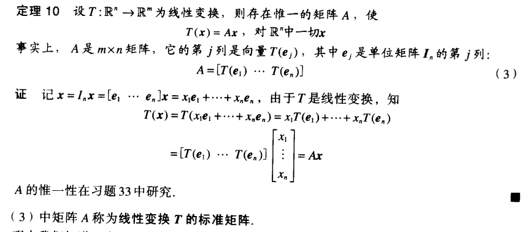
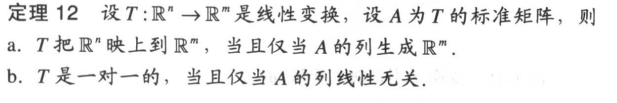

# 线性方程组

##  相关定义

包含未知数$$x_1$$,$$x_2$$,...,$$x_n$$的一个线性方程是：$$a_1x_1 + a_2x_2 + ··· + a_nx_n = b$$

线性方程组：由多个包含相同变量的线性方程组成

解：一组数，对于多个变量，同时满足方程组的多个线性方程

解集：方程组所有可能的解（（无（不相容）、（唯一、无穷个）（相容）））

## 矩阵记号

存在方程组：
$$
\begin{aligned}
x_1-2x_2+x_3= 0 \\
  2x_2-8x_3= 8 \\
  -4x_1+5x_2+9x_3= -9 
\end{aligned}
$$
对应<a name="coefficient_matrix">系数矩阵</a>：
$$
\left[
 \begin{matrix}
   1 & -2 & 1 \\
   0 & 2 & -8 \\
   -4 & 5 & 9
  \end{matrix}
  \right]
$$
对应的增广矩阵（增加右边常数列）：
$$
\left[
 \begin{matrix}
   1 & -2 & 1 & 0 \\
   0 & 2 & -8 & 8 \\
   -4 & 5 & 9 & -9
  \end{matrix}
  \right] \
$$

# 行化简与阶梯形矩阵

## 定义

行化简：通过行初等变化（倍乘变换、对换变换、倍加变换）对普通矩阵化简

先导元素：每一行最左边的非零元素

阶梯形/行阶矩阵：1.每一行非零行在每一零行之上  2.每一行的先导元素所在列位于前一行先导元素的右面 3.某一行先导元素所在列下方元素都是零
$$
\left[
 \begin{matrix}
   [] & * & * & * \\
   0 & 0 & [] & * \\
   0 & 0 & 0 & 0  \\
   0 & 0 & 0 & 0 
  \end{matrix}
  \right]
$$
简化阶梯形（行阶）矩阵：1.每一非零行的先导元素都是1   2.某一行的先导元素是所在列的唯一非零元素
$$
\left[
 \begin{matrix}
   1 & * & 0 & * \\
   0 & 0 & 1 & * \\
   0 & 0 & 0 & 0  \\
   0 & 0 & 0 & 0 
  \end{matrix}
  \right]
$$

## 线性方程组的解

通过行化简，将一个方程组的增广矩阵化为等价的简化行阶矩阵
$$
\left[
 \begin{matrix}
   1 & 0 & -5 & 1 \\
   0 & 1 & 1 & 4 \\
   0 & 0 & 0 & 0   
  \end{matrix}
  \right]
$$
对应的线性方程组是：
$$
\begin{aligned}
x_1-5x_3= 1 \\
  x_2+x_3= 4 \\
  0= 0 
\end{aligned}
$$
对应的通解（即：解集的参数表示）为（有自由变量（即参数）一定要标注）：
$$
\begin{cases}
x_1= 1+5x_3 \\
  x_2= 4-x_3 \\
  x_3是自由变量 
\end{cases}
$$

## 存在与唯一性问题

+ 当一个方程组化为阶梯形，且包含形如0=b(b不等于0)的方程：无解（不相容）

+ 当一个方程组化为阶梯形，且不包含形如0=b(b不等于0)的方程，每个方程包含一个基本变量，且系数不为0
   + 基本变量已经完全确定（无自由变量）：唯一解
   + 至少有一个基本变量可用一个或多个自由变量表示：无穷多解

# 向量方程

## 定义

$$R^n$$中的向量:所有n个实数数列（序n元组）的集合，即n*1列矩阵

向量u与向量v相加：对应的元素相加

向量u与实数c进行标量相乘：u的每个元素乘以c

向量方程：根据向量加法合标量乘法组合

## 意义

向量方程和对应增广矩阵的线性方程组有相同解集，而向量方程通过向量可以联系到对应的几何解释，比如：

求解线性方程组的解等同于判断向量b是否经过Span{u，v}的平面，有直观的几何意义

# 矩阵方程

## 定义

矩阵方程（A$$x$$=b）：矩阵与向量的积

## 解存在

+ 当且仅当b是A的各列的线性组合

+ 定理：下列条件同时成立或不成立

  + 对$$R^m$$中的每个b，方程$$Ax=b$$有解($$Ax=b$$对任意的b有解)

  + $$R^m$$中的每个b都是A的列的一个线性组合
  + A的各列生成$$R^m$$
  + A在每一行都有一个主元位置（A是<a href="#coefficient_matrix">系数矩阵</a>）

## <a name="Ax_character">$Ax$的性质</a>

# 线性方程组的解集

## 齐次线性方程组

定义：$$Ax=0$$形式的方程组（即b=0）

平凡解：齐次方程组至少有一个解，即$$x=0$$（$$R^n$$中的零向量），称为平凡解

定理： 当且仅当方程至少有一个自由变量，齐次方程有非平凡解

## 参数向量方程

解集的向量表现形式：$$x = su + tv$$(s、t为实数，$$u、v$$为自由变量 )，也称参数向量方程

## 非齐次方程组的解

有对应的齐次方程组得到向量形式的解集（有非平凡解），再加上对应的向量$$p$$则得到分齐次方程的解

# 线性无关

定义：对于$$Ax=0$$，当且仅当方程仅有平凡解，矩阵A的各列线性无关

## 矩阵A的不同情况

+ 仅含一个向量$$v$$：当$$v=0$$时向量方程$$x_1v=0$$有非平凡解，矩阵A的各列线性相关

+ 含有两个向量$$v_1、v_2$$：当$$v_1$$是$$v_2$$的倍数时（即：$$v_1$$是$$v_2$$的线性组合），矩阵A的各列线性相关

+ 含两个或更多向量：

  + 若一个向量组个数（列数）超过每个向量元素（行数），矩阵A的各列线性相关
  + 若向量组$$S={v_1,····,v_p}$$包含零向量，矩阵A的各列线性相关（设$$v_1=0$$,则$$t*v_1+0*v_2+···+0*v_p=0$$（$$t$$为任意实数））
  + 对于向量集合$$S={v_1,····,v_p}$$,当且仅当S中至少有一个向量是其他向量的线性组合，矩阵A的各列线性相关

  

# 线性变换

变换（或映射）T线性定义：

* 对T的定义域中的一切u，v，T(u+v) = T(u) + t(v)
* 对一切u和标量c，T(cu)=cT(u)

即矩阵变换（参考<a href="#Ax_character">$Ax$的性质</a>）都是线性变换，线性变换实质上就是一个矩阵变换

## 求线性变换的矩阵

当一个线性变换T是由几何中提出的，求对应的矩阵A变换就是了解T对单位矩阵$$I_n$$各列的作用

## 存在与唯一

* 若$$R^m$$中任一b都至少有一个$$R^n$$中的$$x$$与之对应（满射），映射T：$$R^n -> R^m$$称为到$$R^m$$上的映射

* 若$$R^m$$中任一b至多有一个$$R^n$$中的$$x$$与之对应（单射），映射T：$$R^n -> R^m$$称为一一映射

  