# 特征值与特征向量

定义：A为$$n*n$$矩阵，$$x$$为非零向量，所存在数$$\lambda$$使$$Ax={\lambda}x$$成立，则称$$\lambda$$为A的特征值，$$x$$称为对应$$\lambda$$的特征向量

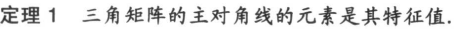

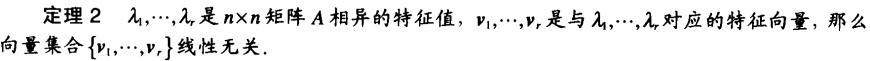

# 特征方程

定义：对于特征值和特征向量有矩阵方程：$$(A-I{\lambda})x=0$$,由于$$x$$非零（即方程有非平凡解），矩阵$$(A-I{\lambda})$$不可逆，数值方程$$det(A-I{\lambda})=0$$称为特征方程

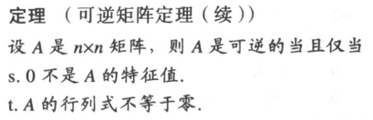

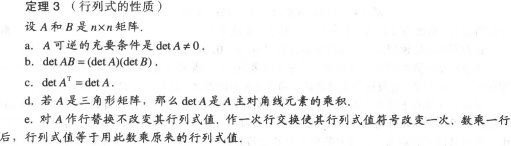

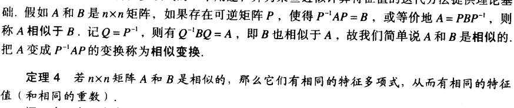

# 对角化

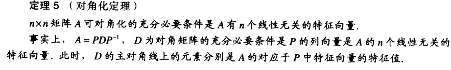

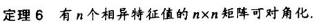

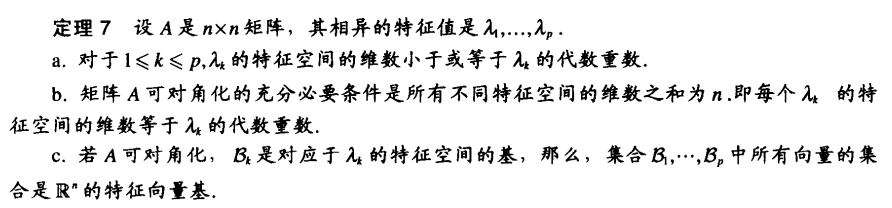

# 特征向量与线性变换

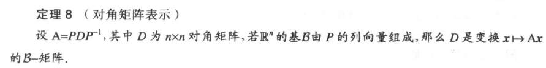

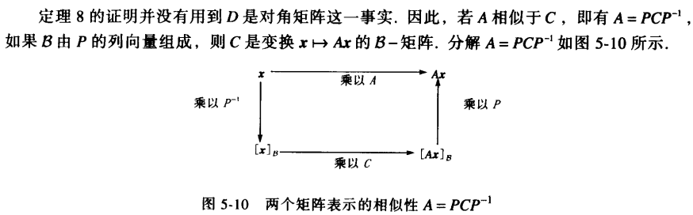

# 复特征值

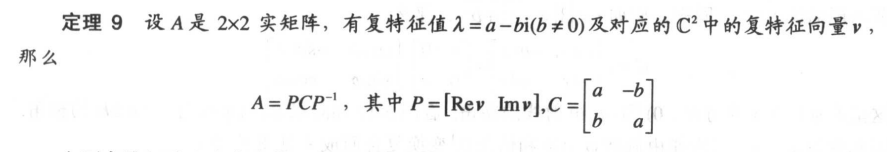

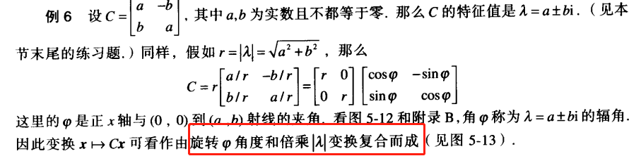