# 内积、长度、正交性

## 内积

如果$$u$$和$$v$$是$$R^n$$空间的向量，则$u^Tv$称为$$u$$和$$v$$的内积，记作$$u·v$$  ,也称点积

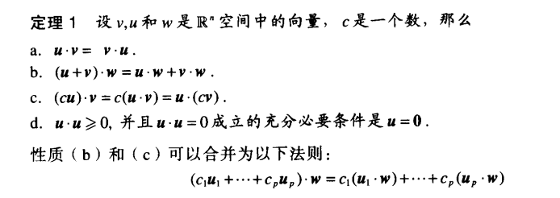

## 向量长度

向量$$v$$的长度（范数）是非负数$$||v||$$,定义为：$$||v||=\sqrt{v·v}=\sqrt{v_1^2+v_2^2+···+v_n^2}$$ 且$$||v||^2=v·v$$

长度为1 的向量称为单位向量，将一个非零向量除以自身长度，即乘以$$\frac{1}{||v||}$$，就可以得到一个单位向量

## $$R^n$$空间中的距离

$$R^n$$种的向量$$u$$和$$v$$的距离，记作dist($$u,v$$)，表示向量$$u-v$$的长度，即：$$dist(u,v)=||u-v||$$

## 正交向量

如果$$u·v=0$$，则两个向量称为（相互）正交的

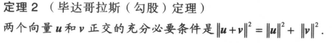

## 正交补

如果向量$$z$$与$$R^n$$的子空间$$W$$种的任意向量都正交，则称$$z$$正交于$$W$$，与子空间$$W$$正交的向量$$z$$的全体组成的集合称为$$W$$的正交补，记为$$W^\perp$$

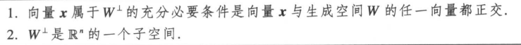

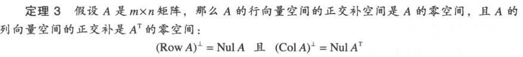

# 正交集

如果集合$$S=\{u_1,···,u_p\}$$的任意两个不同的向量都正交，即当$$i!=j$$时，$$u_i·u_j=0$$，集合$$S$$称为正交向量集

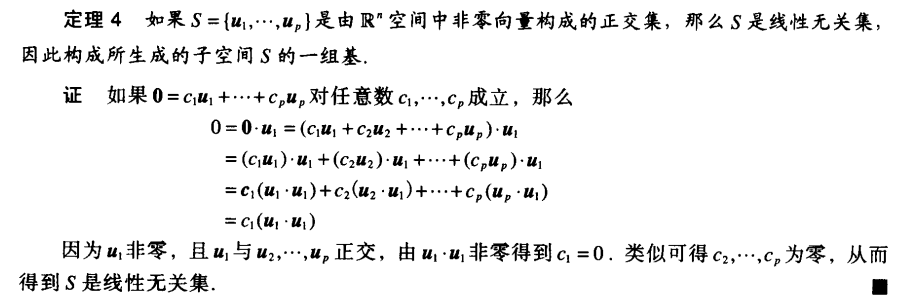

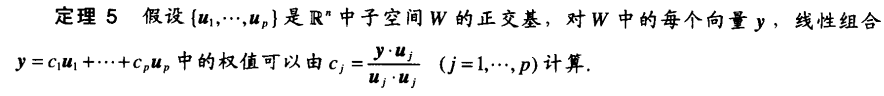

## 正交投影

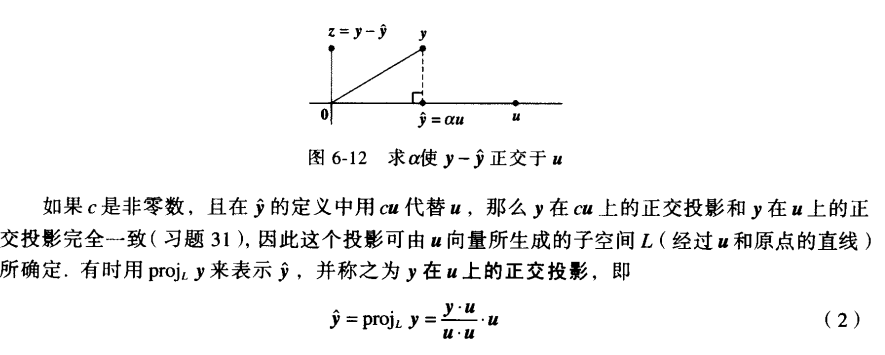

对于定理5，可以把$$y$$看成是$$Span\{u_1,···,u_p\}$$中相互正交的$$p$$个一维子空间上的投影之和

## 单位正交集

由单位向量$$\{u_1,···,u_p\}$$构成的正交集称为单位正交集

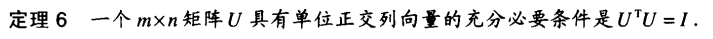

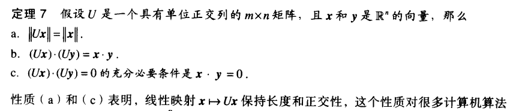

# 正交投影

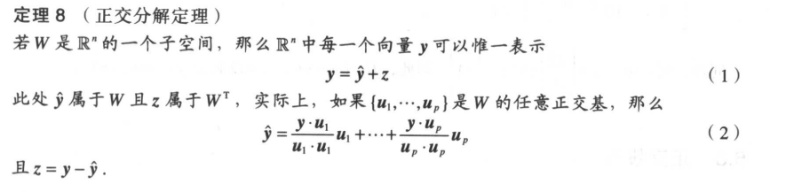

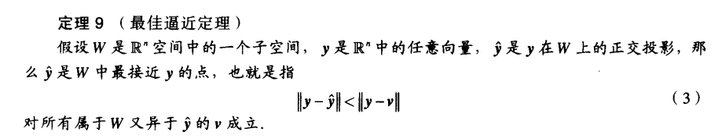

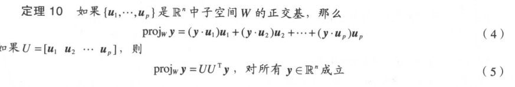

## 格拉姆-施密特方法

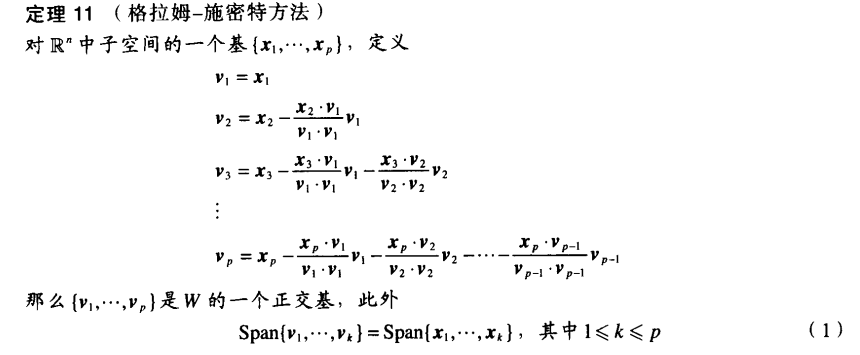

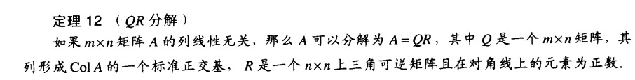

且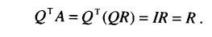

# 最小二乘问题

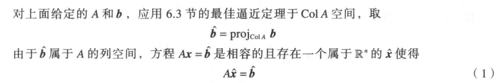

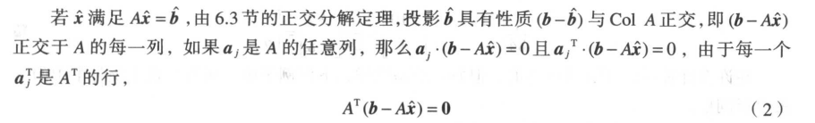

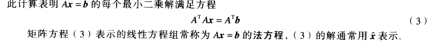

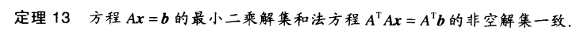

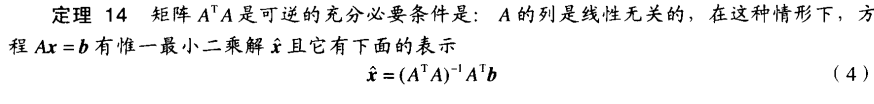

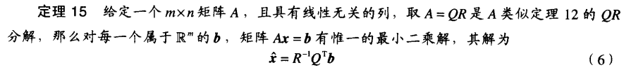