# Http工作原理

HTTP协议是浏览器与服务器之间的数据传送协议。作为应用层协议，HTTP是基于<font color='orange'>TCP/IP </font>协议来传递数据的（HTML文件、图片、查询结果等），HTTP协议不涉及数据包 （Packet）传输，主要规定了客户端和服务器之间的通信格式。

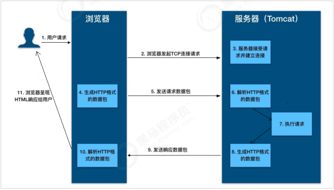

# Tomcat 整体架构

## Http服务器请求处理

浏览器发给服务端的是一个HTTP格式的请求，HTTP服务器收到这个请求后，需要调用服务端程序来处理，调用方式如下:

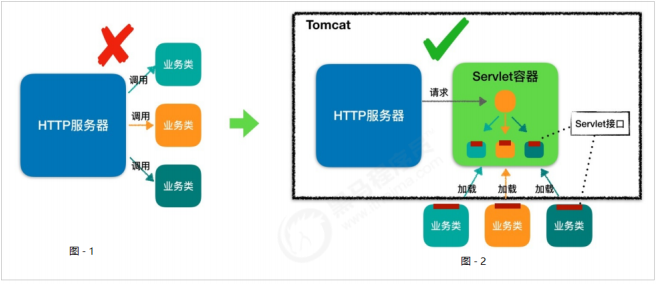

+  图1 ， 表示HTTP服务器直接调用具体业务类，它们是紧耦合的

+  图2，HTTP服务器不直接调用业务类，而是把请求交给容器来处理，容器通过 Servlet接口调用业务类,达到了HTTP服务器与 业务类解耦的目的。

##  Servlet容器工作流程

当客户请求某个资源时，HTTP服务器会用一个ServletRequest对象把客户的请求信息封 装起来，然后调用Servlet容器的service方法，Servlet容器拿到请求后，根据请求的URL 和Servlet的映射关系，找到相应的Servlet，<font color='orange'>如果Servlet还没有被加载，就用反射机制创建这个Servlet</font>，并调用Servlet的init方法来完成初始化，接着调用Servlet的service方法 来处理请求，把ServletResponse对象返回给HTTP服务器，HTTP服务器会把响应发送给 客户端。

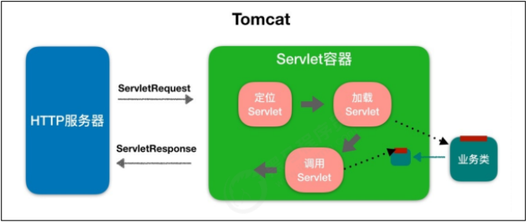

##  整体架构

+ Tomcat设计了两个核心组件连接器（Connector）和容器（Container），分别实现两个核心功能：
  + 处理Socket连接，负责网络字节流与Request和Response对象的转化。
  + 加载和管理Servlet，以及具体处理Request请求。

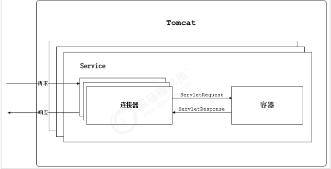

+ 单独的连接器或者容器都不能对外提供服务，需要把它们组装 起来才能工作，组装后这个整体叫作Service组件，<font color='orange'>通过在Tomcat中配置多个 Service组成多个Server</font>，可以实现通过不同的端口号来访问同一台机器上部署的不同应用。

#  连接器 - Coyote

## 架构介绍

+ 客户端通过Coyote与服务器建立连接、发送请求并接受响应 。
+ Coyote 作为独立的模块，封装了底层的网络通信（Socket 请求及响应处理），只负责具体协议和IO的相关操作
+ 为Catalina 容器提供了统一的接口，使Catalina 容器与具体的请求协议及IO操作方式完全解耦。

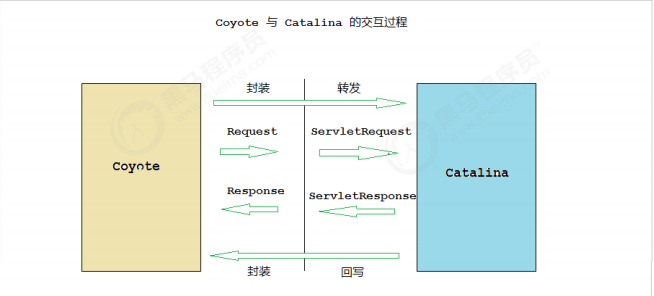

## IO模型与协议

+ Tomcat 支持的IO模型（自8.5/9.0 版本起，Tomcat 移除了 对 BIO 的支持）：

| IO模型 | 描述                                                         |
| ------ | ------------------------------------------------------------ |
| NIO    | 非阻塞I/O，采用Java NIO类库实现。                            |
| NIO2   | 异步I/O，采用JDK 7最新的NIO2类库实现。                       |
| APR    | 采用Apache可移植运行库实现，是C/C++编写的本地库。如果选择该方 案，需要单独安装APR库。 |

+ Tomcat支持的应用层协议：

| 应用层协议 | 描述                                                         |
| ---------- | ------------------------------------------------------------ |
| HTTP/1.1   | 这是大部分Web应用采用的访问协议。                            |
| HTTP/2     | HTTP 2.0大幅度的提升了Web性能。下一代HTTP协议 ， 自8.5以及9.0 版本之后支持。 |
| AJP        | 用于和Web服务器集成（如Apache），以实现对静态资源的优化以及 集群部署，当前支持AJP/1.3。 |

##  连接器组件

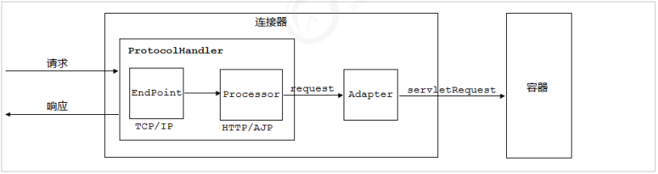

+ EndPoint ：
  +  Coyote 通信端点，即通信监听的接口，是具体Socket接收和发送处理 器，是对传输层的抽象，因此EndPoint用来实现TCP/IP协议的。
  + Tomcat 并没有EndPoint 接口，而是提供了一个抽象类AbstractEndpoint ， 里面定 义了两个内部类：Acceptor和SocketProcessor。
    + Acceptor用于监听Socket连接请求。
    + SocketProcessor用于处理接收到的Socket请求，它实现Runnable接口，在Run方法里调用协议处理组件Processor进行处理。

+ Processor： Coyote协议处理接口 ，用来实现HTTP协议，Processor接收来自EndPoint的Socket，读取字节流解 析成Tomcat Request和Response对象，并通过Adapter将其提交到容器处理。

+ ProtocolHandler： Coyote 协议接口， 通过Endpoint 和 Processor ， 实现针对具体协议的处理能力。

+ Adapter：对于不同模型、协议组成的Tomcat Request类，通过Adapter适配产生ServletRequest

# Servlet容器 - Catalina

##  Tomcat模块分层

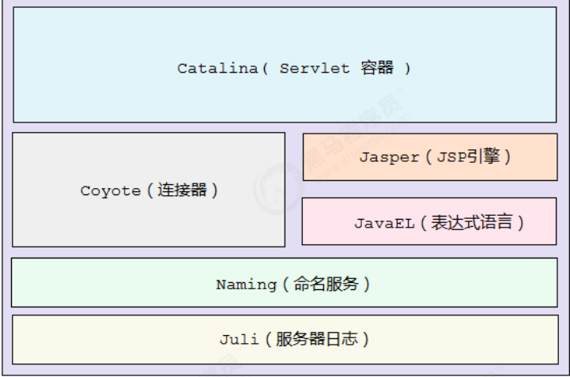

Catalina 是 Tomcat 的核心 ， 其他模块都是为Catalina 提供支撑的

## Catalina 结构：

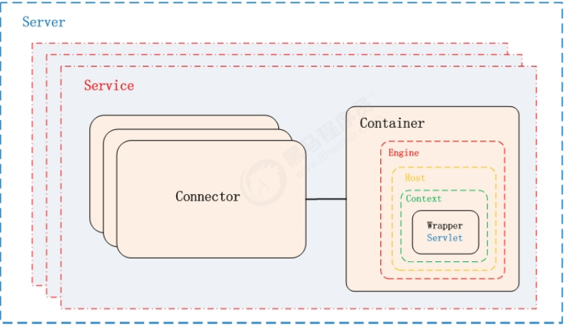     	

+ Apache http server是web服务器，提供静态网页服务
+ weblogic、websphere、JBOSS是应用服务器，可以部署EJB容器
+ Tomcat是web容器，管理和部署 Web应用，<font color='orange'>集成了web服务器的一些基本功能</font>

+ Catalina是servlet容器（Server），管理多个Sevice组件，管理servlet的生命周期
+ Catalina组件如下：

| 组件      | 职责                                                         |
| --------- | ------------------------------------------------------------ |
| Catalina  | 负责解析Tomcat的配置文件 , 以此来创建服务器Server组件，并根据命令来对其进行管理 |
| Server    | 表示整个Catalina Servlet容器以及其它组件，负责组装并启动 Servlet引擎（Container--Engine）,Tomcat连接器。 |
| Service   | 是Server内部的组件，一个Server包含多个Service。它将若干个 Connector组件绑定到一个Container（Engine）上 |
| Connector | 处理与客户端的通信，它负责接收客户请求，然后转给相关的容器处理，最后向客户返回响应结果 |
| Container | 负责处理用户的servlet请求，并返回对象给web用户的模块         |

##  Container 结构：


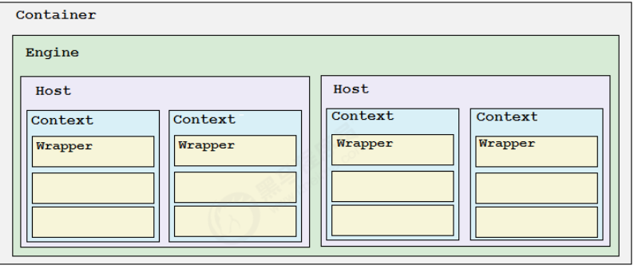

这些容器具有父子关系，形成一个树形结构，各组件的含义：

| 容器    | 描述                                                         |
| ------- | ------------------------------------------------------------ |
| Engine  | 容器对外提供功能的入口，与多个Connector直接对接，每个Engine是Host的集合， |
| Host    | 代表一个虚拟主机，可以给Tomcat配置多个虚拟机地址，处理某一个Connector的请求，而一个虚拟主机下可包含多个Context |
| Context | 表示一个Web应用， 一个Web应用可包含多个Wrapper               |
| Wrapper | 表示一个Servlet，Wrapper 作为容器中的最底层，不能包含子容器  |

# 启动流程

## 流程

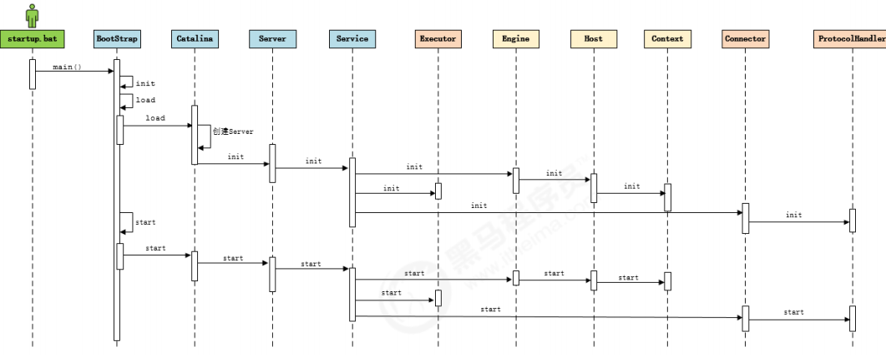

## 源码解析

### LIfecycle

由于所有的组件均存在初始化、启动、停止等生命周期方法，拥有生命周期管理的特性， 所以Tomcat在设计的时候， 基于生命周期管理抽象成了一个接口 Lifecycle，核心方法有：init()、start()、stop（）、destory()

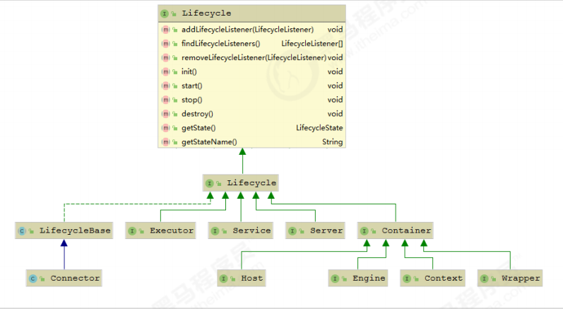

### 主要组件

Server、Service、Engine、Host、Context等主要组件接口都有对应的StandardXX默认实现类，没有对应的Endpoint 接口，但有一个抽象类 AbstractEndpoint，其下有三个实现类： NioEndpoint、 Nio2Endpoint、AprEndpoint，默认使用的是NioEndpoint

### 源码入口

目录： org.apache.catalina.startup

MainClass：BootStrap ‐‐‐‐> main(String[] args)

# Tomcat请求处理流程

+ 请求流程图

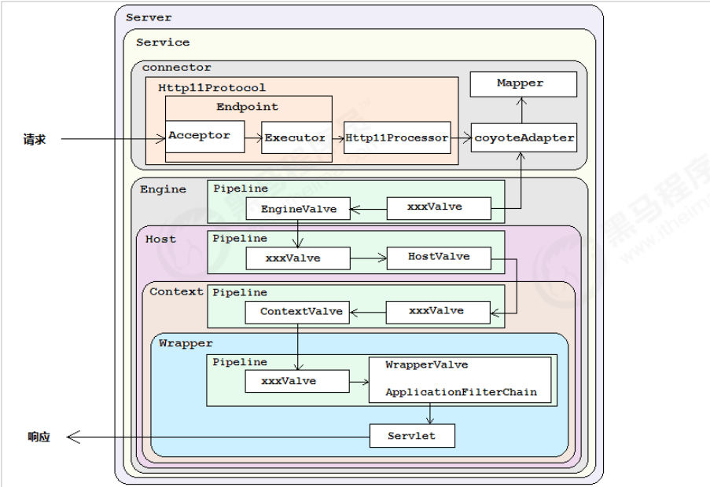

+ 关键节点

  + CoyoteAdapter寻找容器：

    ```java
    connector.getService().getContainer().getPipeline().getFirst().invoke(request, response);
    ```
    + Connecter关联着对应的Service，与之对应关联着一个Engine（Container）
    + ContainerBase定义关联着对应的Pipeline，每个Container（engine、host、context、wrapper）都有对应的Pipeline

  + Container（engine->host->context->wrapper）之间的链接：

    + 每层的container都有对应的StandardValve控制调用下层的pipeline，并且StandardValve位于pipeline的<font color='orange'>末尾</font>

    ```java
    host.getPipeline().getFirst().invoke(request, response);//在StandardEngineValve中
    ```

    + pipeline的firstValve调用下一个Valve（自定义Valve应该实现）或者下一层的container（当fisrtValve是StandardValve时）

    + 通过request获取下层container信息

      ```java
      Host host = request.getHost();//在StandardEngineValve中
      ```

      request中的container信息是通过mapper保存到request的mappingData中

      ```java
      connector.getService().getMapper().map(serverName, decodedURI,version, request.getMappingData());//在CoyoteAdapter中
      ```

