# 矩阵运算

## 标量乘法

设A，B，C是相同维数的矩阵，$$r$$与$$s$$为数，则有：

a. A+B = B+A              b.（A+B)+C = A+(B+C)

c. A+0 = A                   d. $$r$$(A+B) = $$r$$A+$$r$$B

e. ($$r$$+$$s$$)A = $$r$$A+$$s$$A      f. r(sA) = (rs)A

## 矩阵乘法

矩阵AB的定义：

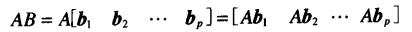

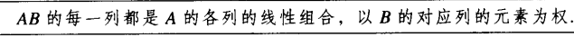

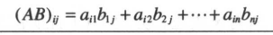

矩阵AB的性质：

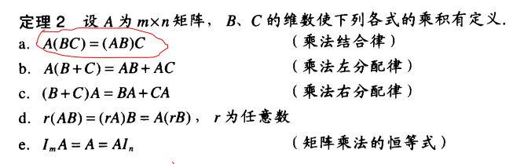

## 矩阵转置

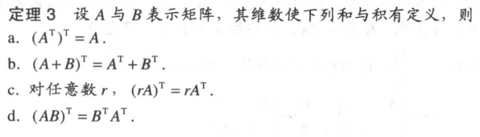

# 矩阵的逆

* 定义：若存在一个$$n*n$$矩阵C使：AC=$$I$$ 且CA=$$I$$, 则$n*n$矩阵A使可逆的
* 2*2矩阵的简单检验公式

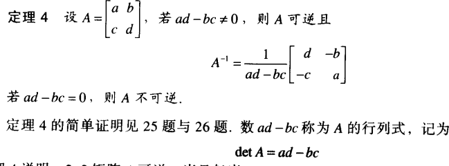

* 计算解

  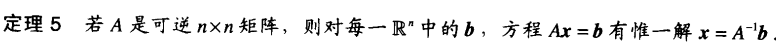

* 可逆矩阵的性质
  * 若A使可逆的，则$$A^{-1}$$也可逆且$${(A^{-1})}^{-1} = A$$
  * 若A、B都是$$n*n$$矩阵，AB也可逆，且其逆使A和B的逆矩阵按相反顺序的乘积,即：$$(AB)^{-1} = B^{-1}A^{-1}$$
  * 若A可逆，则$$A^T$$也可逆，且其逆使$$A^{-1}$$的转置，即：$$(A^{T})^{-1} = (A^{-1})^T$$

* 初等行变换

  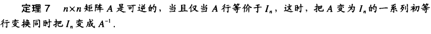

# 可逆矩阵的特征

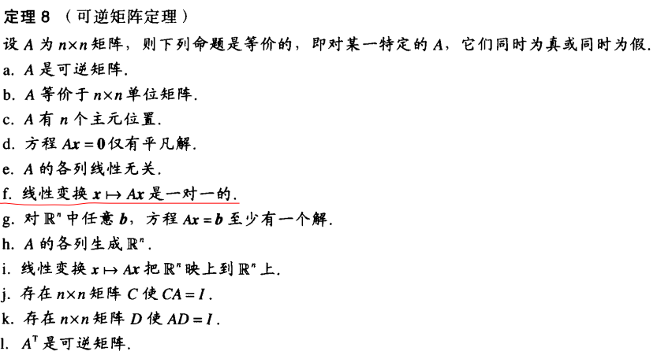

# 矩阵因式分解

求解过程：

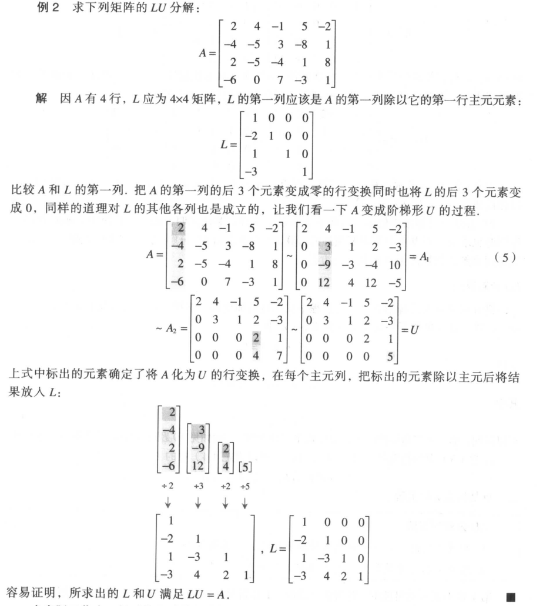

优势：

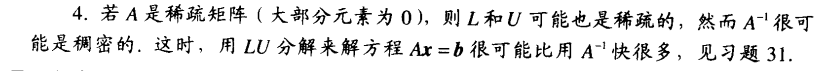

# 计算机图形学中的应用

对一系列坐标点（矩阵）进行线性变换（左乘矩阵）

## 齐次坐标

平移并非线性变换，所以引入所谓的齐次坐标

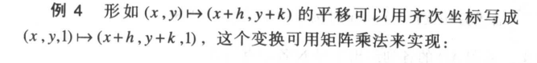

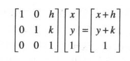

$$R^2$$中的任意线性变换也可以通过齐次坐标以分块矩阵公式$$\left[
 \begin{matrix}
   A & * \\
   0 & 1 
  \end{matrix}
  \right]$$实现，例如：

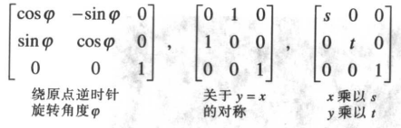

# $$R^n$$的子空间

$$R^n$$中的一个子空间是$$R^n$$中的集合H，具有以下三个性质：

*  零向量属于H
* 对H中任意的向量$$u$$ 和$$v$$，$$u+v$$属于H
* 对H中任意的向量$$u$$和数c，c$$u$$属于H

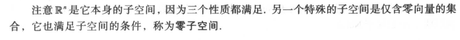

## 矩阵的列空间和零空间

* 矩阵A的列空间是A的各列的线性组合的集合，记作Col A
* 矩阵A的零空间是齐次方程$$Ax=0$$的所有解的集合，记为Nul A

## 子空间的基

$$R^n$$中子空间的一组基是H中一个线性无关集，它生成H

求解矩阵零空间的基：

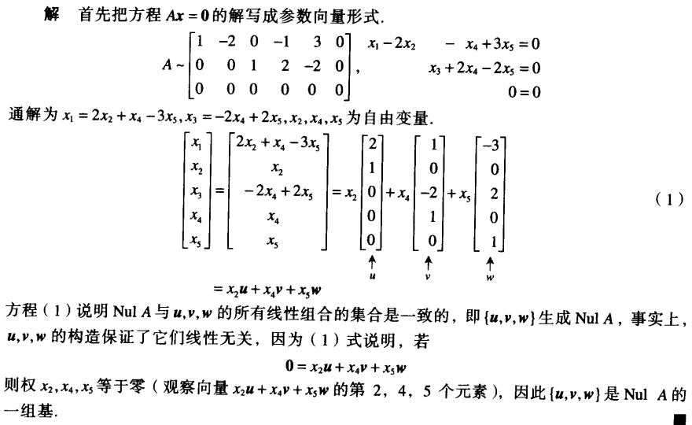

求解列空间的基：

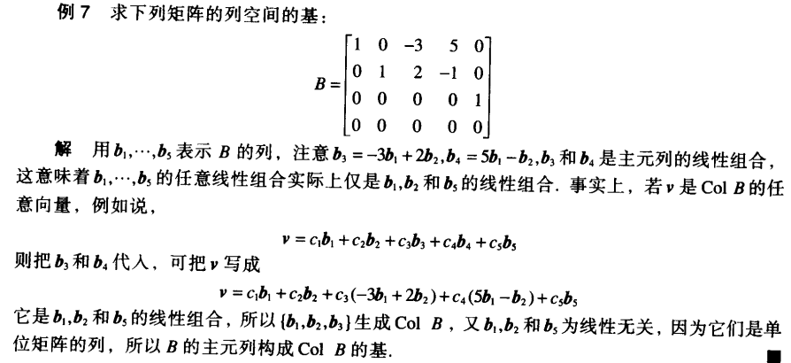

# 维数和秩

## 坐标系

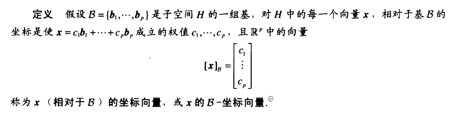

基的变换：

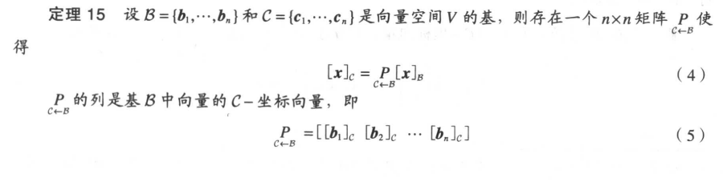

## 子空间的维数

非零子空间的维数，用$$dimH$$表示，是$$H$$的任意一个基的向量个数。零子空间{0}的维数定义为零（零向量本身构成一个线性相关集，即零子空间无基）

* 矩阵A的秩（记为rank A）是A的列空间的维数
* 秩序理：如果一矩阵有n列，则$$rankA + dimNulA = n$$
* 基定理：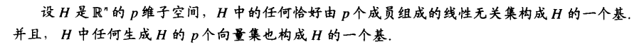

## 秩与可逆矩阵

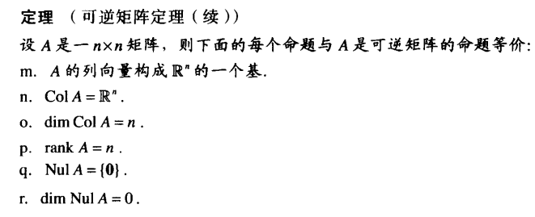